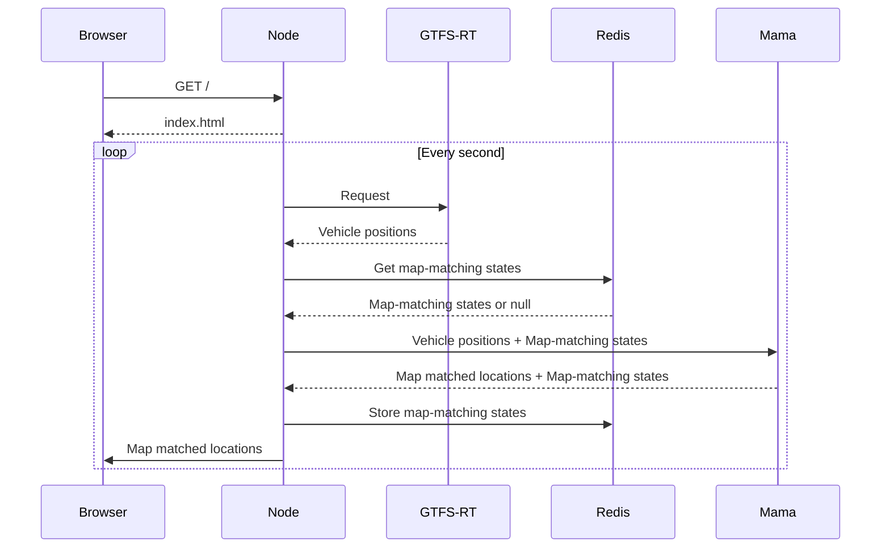

# Mama Demo

This demo polls [GTFS-RT feed of Warsaw's public transport](https://mkuran.pl/gtfs/) and visualizes map matched positions of vehicles on a map.

## Build and run

**Prerequisites**: [`osmium`](https://osmcode.org/osmium-tool/), `wget` and [Docker](https://www.docker.com/)

1. [`./build.sh`](./build.sh) - it prepares data and build required Docker images
2. `docker compose up`
3. Open web browser and navigate to `http://127.0.0.1:8000/`
4. You should see something like this(vehicles positions are updated every 10 seconds):

## Design

For basic understanding how this demo works look at this diagram:

