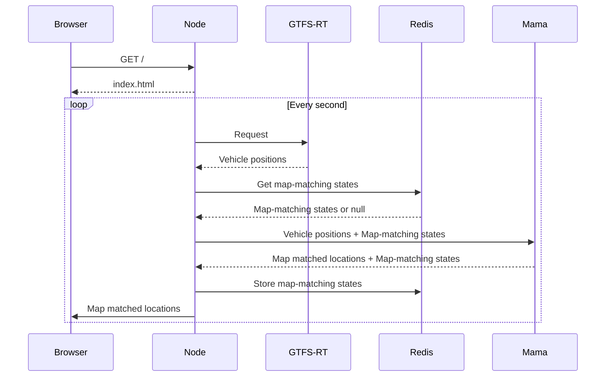

# Mama Demo

## Design

For basic understanding how this demo works look at this diagram:

```mermaid
sequenceDiagram 
  Browser->>Node: GET /
  Node-->>Browser: index.html
  loop Every second
    Node->>GTFS-RT: Request 
    GTFS-RT-->>Node: Vehicle positions
    Node->>Redis: Get map-matching states
    Redis-->>Node: Map-matching states or null
    Node->>Mama: Vehicle positions + Map-matching states
    Mama-->>Node: Map matched locations + Map-matching states
    Node->>Redis: Store map-matching states
    Node->>Browser: Map matched locations
  end
```
